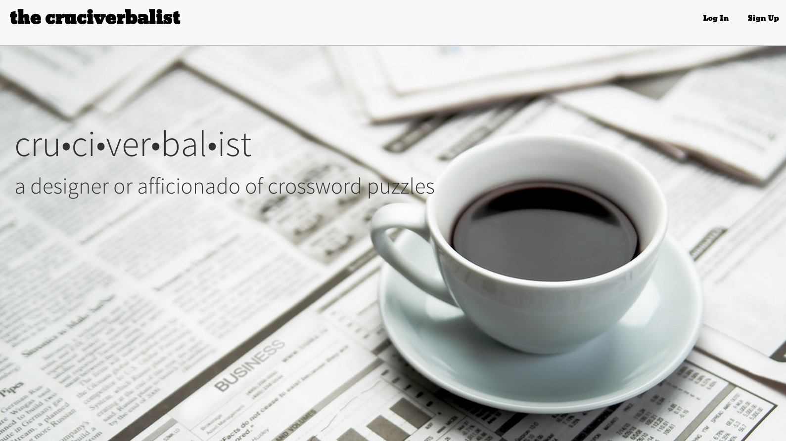
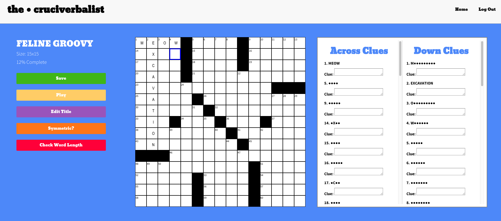

# The Cruciverbalist

[Live][live]

[live]: www.thecruciverbalist.com

The Cruciverbalist is a project I have imagined for a few years now. I have always enjoyed crosswords and while I was in college, I started making my own crossword puzzles. I was surprised to learn that no app existed for crossword creators. I found myself using graph paper and countless Microsoft Word documents to create my puzzles. While in App Academy, I realized at had the tools to make a site to ease the process of crossword creation and decided to implement this for my final project. Check out the sign using the link above! Be sure to login as a guest for a demonstration of the site's key features.

## Minimum Viable Product
The Cruciverbalist is a site for crossword puzzle creators and enthusiasts. Users can:

<!-- This is a Markdown checklist. Use it to keep track of your progress! -->

- [X] Create accounts
- [X] Create sessions (log in)
- [X] Create puzzle grids of different sizes
- [X] Create puzzle answers
- [X] Create clues associated with an answer
- [X] Save puzzles
- [X] Check puzzle for symmetry
- [X] Check puzzles for word length
- [X] Implement play puzzle mode
- [X] Puzzle of the day feature
- [X] Clues / square numbers update automatically

## Design Docs
* [View Wireframes][views]
* [DB schema][schema]

[views]: ./docs/views.md
[schema]: ./docs/schema.md

## Implementation Timeline

### Phase 1: User Authentication & Profiles (~1 day)
I will implement user authentication in Rails based on the practices learned at
App Academy. By the end of this phase, users will be able to create accounts and sign in and out of the site. Users will also have public profiles and home pages created with the Backbone app.

[Details][phase-one]

### Phase 2: Puzzles, Clues, Squares (~5 days)
In this phase, I am going to make Rails models for my clues, puzzles, and squares. I will build associations between the models. I will make a Backbone app and api controllers for all three of these models. By the end of this phase, users will be able to create new puzzle grids and fill them in with answers. They will also be able to create clues. As users update their puzzle grid, the square numbers and clues will update automatically.

[Details][phase-two]

### Phase 3: Playable Puzzles (~2 days)
In this, phase I am going to build up some functionality to allow users to play puzzles. This will involve adding a games table to the database which associates a player to a puzzle. The table will also store the time it takes the player to correctly solve the puzzle. When users play a puzzle, they will no longer be able to modify the grid or clues.

[Details][phase-three]

### Phase 4: Home View & Puzzle Index (2 days)
Here, I will create a home view where users can create new puzzles, access their own puzzles, and play the puzzle of the day. I will also add a puzzle index view that lists all of a user's puzzles.
[Details][phase-four]

### Phase 5: CSS Styling (~2 days)
The last two days I will spend making my site look as good as possible, mainly working with CSS to fix all the styling. I will also use Bootstrap to improve the styling.

[Details][phase-five]

### Bonus Features (TBD)
- [ ] Follow other users
- [ ] User profiles
- [ ] Allow users to save multiple drafts of a puzzle
- [ ] Search for specific clues/answers
- [ ] Check if a word is valid w/ included dictionary
- [ ] Rate other users puzzles
- [ ] Pagination/infinite scroll
- [ ] Activity history
- [ ] Comments on puzzles
- [ ] Algorithm that creates puzzles for you
- [ ] Multiple sessions/session management
- [ ] User avatars
- [ ] Typeahead search bar

[phase-one]: ./docs/phases/phase1.md
[phase-two]: ./docs/phases/phase2.md
[phase-three]: ./docs/phases/phase3.md
[phase-four]: ./docs/phases/phase4.md
[phase-five]: ./docs/phases/phase5.md
